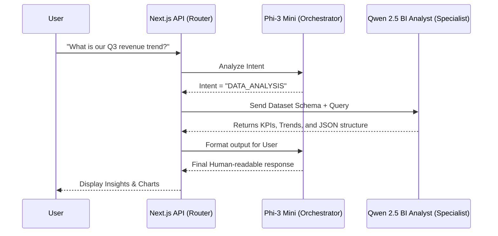
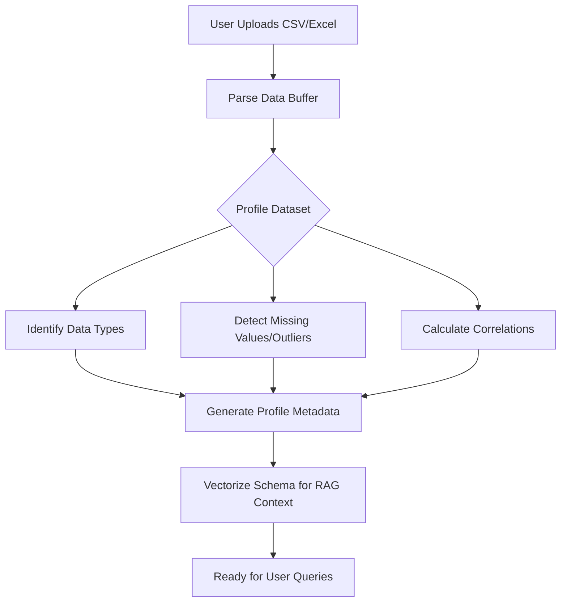

# 🚀 AI Business Intelligence Copilot
**A privacy-preserving, local-first BI copilot powered by Dual-Model AI**

---

## 📖 Overview

The **AI Business Intelligence Copilot** is a powerful, locally-hosted platform that allows you to upload raw datasets (CSV/Excel) and immediately gain actionable insights. Powered entirely by local LLMs via Ollama, it ensures that your sensitive business data never leaves your machine. 

By employing a **Dual-Model Architecture**, the copilot intelligently routes general queries to a lightweight assistant and complex data analytical queries to a specialized, fine-tuned BI analyst model, providing fast, accurate, and structured insights even on low-VRAM hardware (e.g., 4GB VRAM).

## ✨ Key Features

- 📊 **Automated Data Profiling**: Instantly analyzes uploaded datasets for missing values, outliers, duplicate records, correlations, and distributions.
- 💬 **Natural Language Querying**: Ask complex questions about your data in plain English and receive instant, context-aware answers.
- 📈 **Statistical Forecasting**: Run predictive modeling on time-series data with calculated confidence intervals.
- 📑 **Executive Reporting**: Automatically compile insights into highly formatted, professional PDF summaries and PowerPoint (PPTX) slide decks.
- 🔒 **100% Local & Private**: No cloud APIs, no data telemetry. Everything runs on your hardware using `llama.cpp` and `Ollama`.

---

## 🧠 Dual-Model Architecture

To optimize performance on consumer hardware, this copilot utilizes a specialized dual-model workflow:

1. **The Orchestrator / Critic (`phi3:mini`)**: A highly efficient generalist model responsible for understanding user intent, managing conversational context, and formatting output.
2. **The BI Specialist (`qwen2.5-bi-analyst` - Custom GGUF)**: A fine-tuned Qwen 2.5 3B model optimized for structured data analysis, KPI extraction, and complex reasoning over tabular datasets.

### Workflow: Query Routing



### Workflow: Data Ingestion & Profiling



---

## 🚀 Getting Started

### Prerequisites
- **Node.js**: v20 or higher.
- **Ollama**: Installed and running locally.
- **Hardware**: Minimum 8GB RAM (4GB VRAM recommended for dual-model execution).

### Installation

1. **Clone the repository:**
   ```bash
   git clone https://github.com/AbhiSTDW/ai-bi-copilot.git
   cd ai-bi-copilot
   ```

2. **Install dependencies:**
   ```bash
   npm install
   ```

3. **Configure Environment:**
   Copy the example environment file and configure it:
   ```bash
   cp .env.example .env.local
   ```

4. **Setup Local Models in Ollama:**
   Pull the general assistant model:
   ```bash
   ollama pull phi3:mini
   ```
   *Note: For the BI Analyst model, use the custom `qwen2.5-bi-analyst` GGUF provided in the `finetune/` directory or swap to `llama3.2:3b-instruct` in your `.env.local`.*

5. **Run the Application:**
   ```bash
   npm run dev
   ```

6. Open your browser and navigate to `http://localhost:3000`.

---

## 🛠️ Tech Stack

- **Frontend**: Next.js 14, React, Tailwind CSS, Chart.js, Framer Motion
- **Backend**: Next.js API Routes, Node.js
- **AI Inference**: Ollama, `llama.cpp`
- **Data Processing**: SheetJS, PDFKit, PptxGenJS

## 📄 License

This project is licensed under the MIT License.
