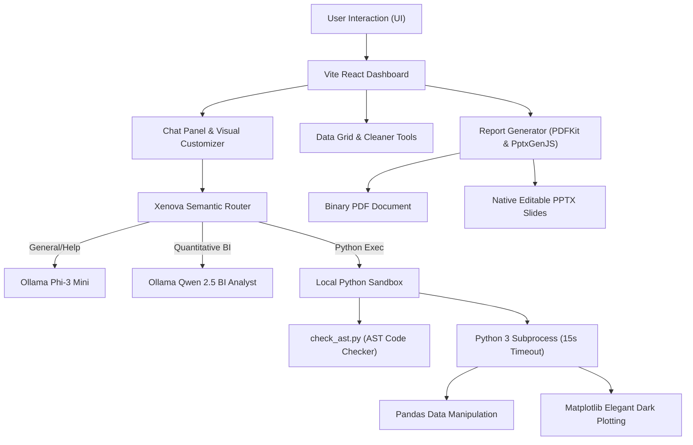
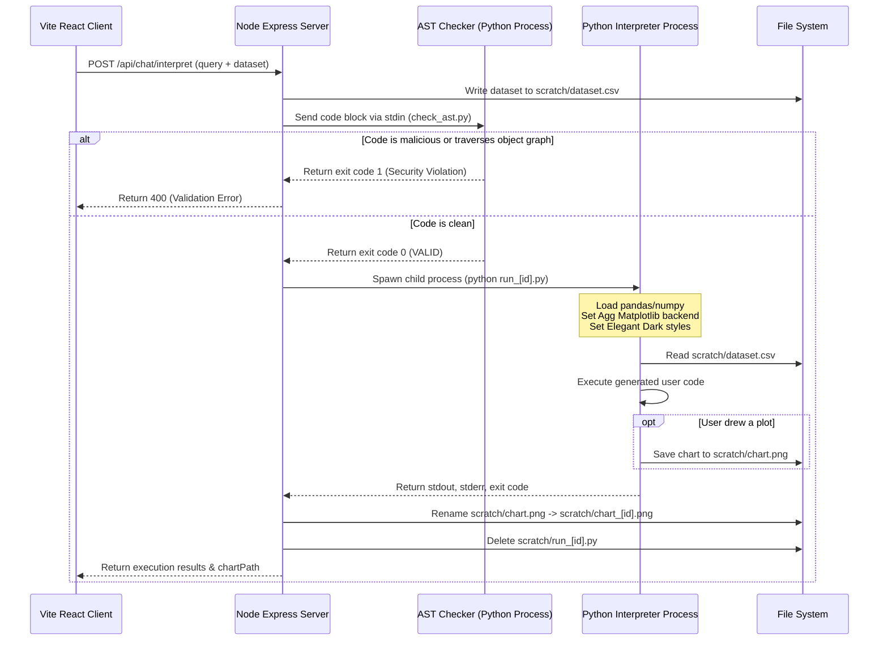

# 🚀 Local-First AI Business Intelligence Copilot
**A privacy-preserving, enterprise-grade local BI copilot powered by a Dual-Model AI pipeline, a sandboxed Python interpreter, and persistent vector databases.**

---

## 📖 Overview

The **AI Business Intelligence Copilot** is a 100% offline, local-first platform designed to ingest raw datasets (CSV/Excel), compile automated diagnostic profiles, clean transactional data, perform statistical forecasting, execute sandboxed Python calculations, and export native PowerPoint and PDF executive reports—all completely on your local machine. 

By employing a **Dual-Model Architecture** alongside a **Semantic Query Router**, the copilot orchestrates high-speed, structured analysis. It classifies queries and routes them dynamically to either a lightweight generalist assistant, a fine-tuned data specialist, or a secure local Python interpreter. This allows for fluid, private, and fast data analytics even on standard consumer hardware.

---

## ✨ Key Features

### 1. Ingestion, Profiling, & Dynamic Data Cleaning
* **Automated Dataset Profiling**: Ingests Excel/CSV files, checks data quality scores, measures completeness ratios, identifies outliers, and extracts key business metrics.
* **Inline Cleaning Actions**: Interactively drop redundant columns, remove duplicate rows, or fill missing cells using median statistical fallbacks directly within the data grid.

### 2. Dual-Model Intent Router
* **Semantic Vector Routing**: Classifies queries via local sentence embeddings (`@xenova/transformers`) mapped against semantic intent centroids.
* **Orchestrator & Specialist Separation**: 
  * **General Assistant/Critic (`phi3:mini`)** handles platform guides, socratic critiques, and textual reviews.
  * **BI Analyst (`qwen2.5-bi-analyst`)** extracts KPI formulas, handles churn indicators, and structures narrative briefs.

### 3. Secure Python Code Interpreter
* **AST Validation Engine**: Pre-scans user scripts utilizing Python's Abstract Syntax Tree parser to block dynamic import escapes, object graph traversal, and code injection.
* **Local Sandbox Subprocess**: Runs calculations safely with a 15-second child-process timeout, loading the dataset pre-filtered.
* **Matplotlib Dark Mode Integration**: Automatically captures plot images drawn in Matplotlib and styles them to match the system's unified elegant dark theme.

### 4. Interactive Visual Customizer
* **Client-Side Real-Time Aggregation**: Customize dashboard metrics, categorical axes, chart formats (Bar, Line, Area, Pie, Scatter), and visual color palettes.
* **Dynamic Reflows**: Visually customize any card inline and watch the charts re-plot instantly.

### 5. Report Generation Pipelines
* **Native PPTX Charts**: Exports structured presentations using `pptxgenjs` where chart layouts contain native, fully editable charts.
* **Formatted PDFs**: Generates printable executive summaries via `pdfkit`.

---

## 🏗️ System Architecture

### Component Diagram


### Python Sandbox Execution Flow


---

## 🚀 Getting Started

### Prerequisites
* **Node.js**: v20 or higher.
* **Python 3**: Installed on the system path (required for sandbox calculations & plotting).
* **Ollama**: Installed and running locally.
* **Hardware**: Minimum 8GB RAM (4GB VRAM recommended for dual-model execution).

### Installation & Local Setup

1. **Clone the Repository**:
   ```bash
   git clone https://github.com/AbhiSTDW/ai-bi-copilot.git
   cd ai-bi-copilot
   ```

2. **Install Node Dependencies**:
   ```bash
   npm install
   ```

3. **Configure Environment Variables**:
   Create a `.env` file in the project root:
   ```env
   PORT=3000
   OLLAMA_BASE_URL=http://localhost:11434
   CHROMADB_URL=http://localhost:8000
   ```

4. **Pull Ollama Models**:
   ```bash
   # Generalist / Critic model
   ollama pull phi3:mini
   ```

5. **Setup Specialist GGUF weights**:
   If utilizing the custom fine-tuned `qwen2.5-bi-analyst` model, run the automated setup PowerShell script:
   ```powershell
   ./setup-model.ps1
   ```
   *Note: This creates the specialist profile using the GGUF weights in `finetune/`.*

6. **Start the Application**:
   ```bash
   npm run dev
   ```
   Open `http://localhost:3000` in your web browser.

---

## 🧪 Testing & Verification

All verification tests are organized inside the `tests/` directory and can be executed via package managers:

* **Relocated Test Suite (Standard Pipelines)**:
  Verifies server health, ingestion profiling, statistical forecasts, intent classification, socratic expert reviews, and PDF/PPTX exporters.
  ```bash
  npm run test
  ```

* **Python Interpreter & Sandbox Tests**:
  Verifies AST static code validations, mathematical computations, matplotlib dark theme exports, and malicious bypass blocks.
  ```bash
  npm run test:interpreter
  ```

* **Real-World Superstore Dataset Stress Test**:
  Runs ingestion, predictive analysis, and slide compilation against the full 10k Superstore records.
  ```bash
  npm run test:superstore
  ```

---

## 📄 License
This project is licensed under the Apache 2.0 License.
